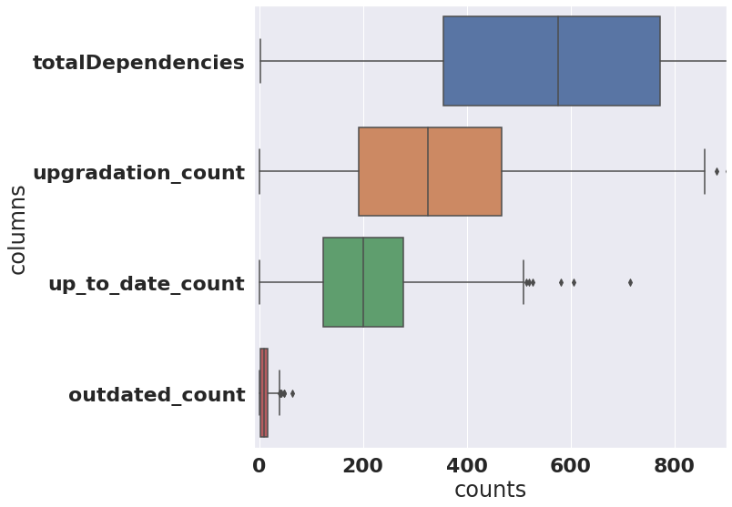
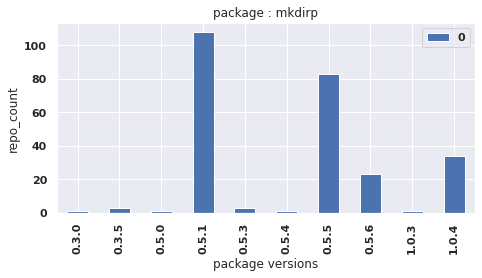
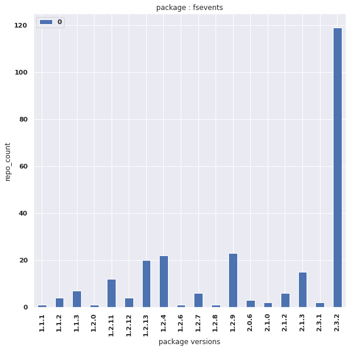

# RMS_Project

Contributed by

    GROUP-1:
    -   G.V.S BHASKAR(vg588)
    -   ANUDEEP UPPU(au282)
    -   KEERTHANA VIJAYKUMAR(kv582)
    -   SAHANA VALLU(sv799)
    -   MOHANTHI SANDEEP(ma3924)

## Title:
---
    Effect of Project Dependencies on the Health of the Software Project

## Research AIM:
---
    Our aim is to analyze the project dependencies of git repository and show the effect of project dependencies on the health of the project. 

## Research Questions:
---
    - Research Question 1 : Does deprecated packages affect the health of a software project?​

    - Research Question 2 : How does the project’s health get affected if the dependencies are not upgraded to their latest versions?

## Data Collection:
---

### Tool : 
    GH Search

### Filters:
    -   Language    :   JavaScript
    -   Created at  :   >= 01-01-2010 - Present
    -   License     :   MIT License
    -   Star Count  :   >= 3366

### Results:
    1130 repositories

## Data Cleaning:
---
    Repositories having package-lock.json and dependencies count > 0

For steps related to data cleaning refer to [Data_Filtering_Notebook](./Research_Method/Data_Filtering.ipynb)

### Results:
    330 repositories

Then, we have collected counts (outdated count, upgradation count, up-to-date count) for each repository.

## Data Analysis:
---
We have performed descriptive statistics

    - Descriptive Statistics:
        mean:
            outdated count	    -   11.5
            upgradation count	-   348.2
            up-to-date count	-   210.7
        
        strong correlation between:
            upgradation count - total dependency​
            outdated count - total dependency

    - Qualitative Statistics:
        Collected packages used in each repository.​
        
        Analyzed 111 packages manually​

        Out of which we found two interesting packages :​
            mkdirp
            fsevents​

For steps related to data analysis refer to [Data_Filtering_Notebook](./Research_Method/Data_Analysis.ipynb)

## Results:
---
- ### Descriptive Analysis:

    

- ### Qualitative Analysis:
    - Package   : mkdirp

        

    - Package   : fs-events
        
        
    
## Answers:
---
- Research Question 1 : Does deprecated packages affect the health of a software project?​
    
        Yes

- Research Question 2 : How does the project’s health get affected if the dependencies are not upgraded to their latest versions?​

        Missing of important features​

## Threats to validity:
---

    - Repositories in between (2010 – present) may have missed dependency issues present in the past years.​

    - Confining our analysis to JavaScript language, repositories with MIT license​ and projects with package-lock.json.​

    - Manual check of 111 packages might lead to bias in results due to human error.​

## Conclusion:
---
    - Objective - to identify the project dependency effects on the health of the project.​

    - A study on 330 repositories to check for deprecated and upgradable package dependency.​

    - Manually analyzed 111 packages as qualitative analysis.​

    - Failure to remove deprecated dependencies might raise issues in the project health (mkdirp)​

    - Failure to update packages to latest versions  - loose support for the important features(fsevents).​

## Future work: 
---
    GitHub Plugin​ which can summaries the health of the project dependencies.

## References:
---
    [1] Rabe Abdalkareem, Olivier Nourry, Sultan Wehaibi, Suhaib Mujahid,
    and Emad Shihab. 2017. Why do developers use trivial packages? an
    empirical case study on npm. Proceedings of the 2017 11th Joint Meeting
    on Foundations of Software Engineering, 385–395. https://doi.org/10.
    1145/3106237.3106267

    [2] Rabe Abdalkareem, Vinicius Oda, Suhaib Mujahid, and Emad Shihab.
    2020. On the impact of using trivial packages: an empirical case study
    on npm and PyPI. Empirical Software Engineering 25 (3 2020), 1168–
    1204. Issue 2. https://doi.org/10.1007/s10664-019-09792-9

    [3] C. Artho, K. Suzaki, R. Di Cosmo, R. Treinen, and S. Zacchiroli. 2012.
    Why do software packages conflict? 2012 9th IEEE Working Conference
    on Mining Software Repositories (MSR), 141–150. https://doi.org/10.
    1109/MSR.2012.6224274

    [4] Filipe Roseiro Cogo. 2020. https://dl.acm.org/doi/abs/10.5555/AAI28387722.
    https://dl.acm.org/doi/abs/10.5555/AAI28387722

    [5] Joel Cox, Eric Bouwers, Marko van Eekelen, and Joost Visser.
    2015. Measuring Dependency Freshness in Software Systems. 2015
    IEEE/ACM 37th IEEE International Conference on Software Engineering,
    109–118. https://doi.org/10.1109/ICSE.2015.140

    [6] Alexandre Decan and Tom Mens. 2021. What Do Package Dependencies Tell Us About Semantic Versioning? IEEE Transactions on Software
    Engineering 47 (6 2021), 1226–1240. Issue 6. https://doi.org/10.1109/
    TSE.2019.2918315

    [7] Joseph Hejderup. 2015. In Dependencies We Trust: How vulnerable
    are dependencies in software modules?

    [8] Abbas Javan Jafari, Diego Elias Costa, Rabe Abdalkareem, Emad Shihab,
    and Nikolaos Tsantalis. 2021. Dependency Smells in JavaScript Projects.
    IEEE Transactions on Software Engineering (2021), 1–1. https://doi.org/
    10.1109/TSE.2021.3106247

    [9] Lucas Mancini. 2018. A simple strategy to manage your JavaScript
    project’s dependencies. https://medium.com/coorva/a-simplestrategy-to-manage-your-javascript-projects-dependenciesd413f3d0ed2f

    [10] Mybridge. 2018. 25 Amazing Open Source React.js Projects for the
    Past Year. https://medium.mybridge.co/react-js-open-source-for-thepast-year-2018-a7c553902010

    [11] Ahmed Zerouali, Valerio Cosentino, Tom Mens, Gregorio Robles, and
    Jesus M. Gonzalez-Barahona. 2019. On the Impact of Outdated and
    Vulnerable Javascript Packages in Docker Images. 2019 IEEE 26th International Conference on Software Analysis, Evolution and Reengineering
    (SANER), 619–623. https://doi.org/10.1109/SANER.2019.866798